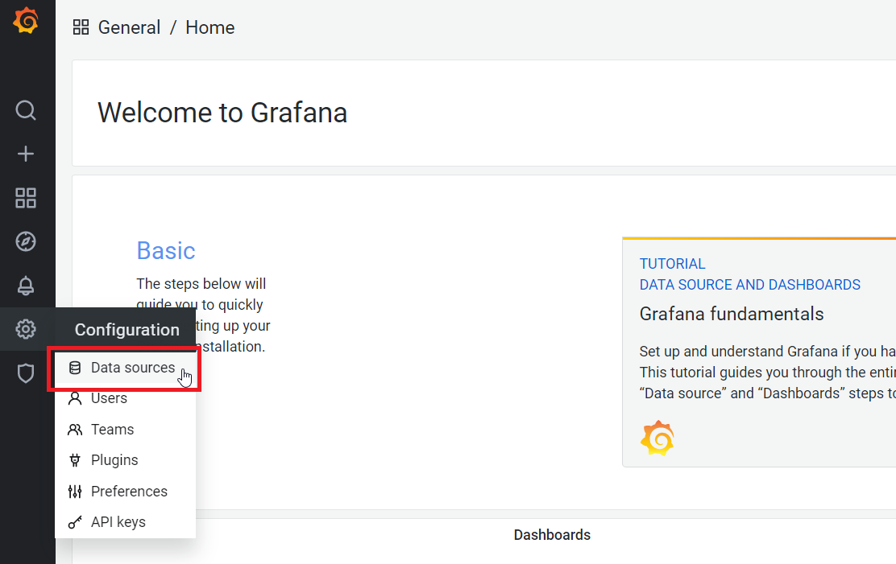
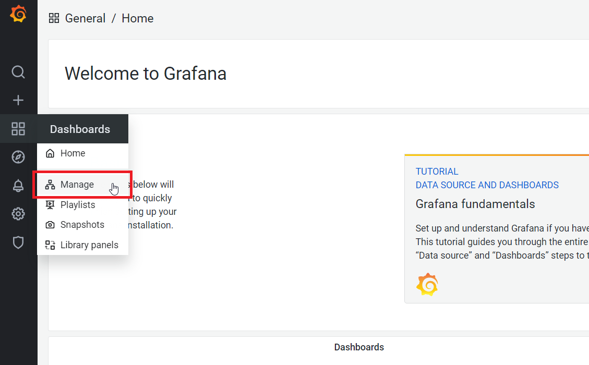
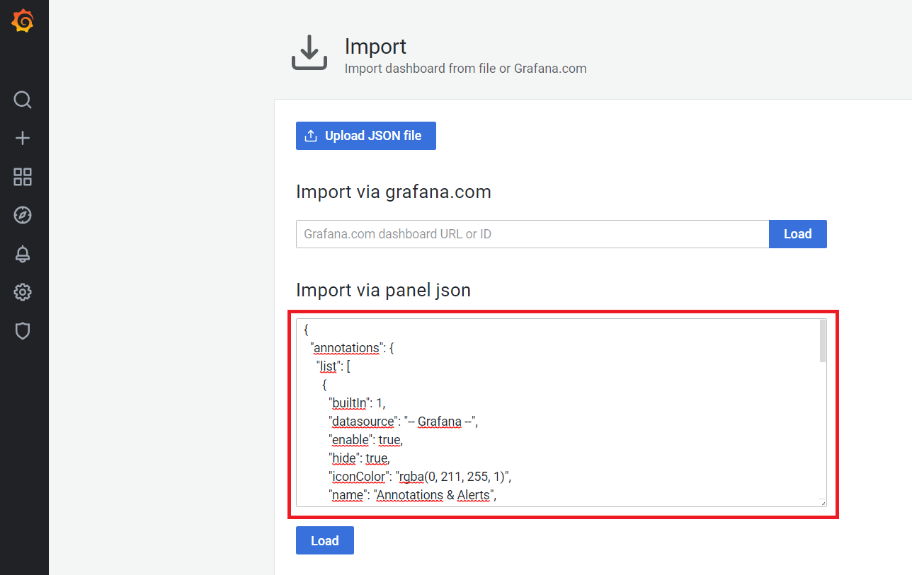

# Grafana

## Setup
The default port of Grafana is 3000 with default credentials `admin / admin`. After first start you need to setup your
MariaDB database as MySQL datasource and import the Grafana dashboards from the grafana sub-direcotry.

### Add datasource
To add a new datasource click in `Configuration` tab in the panel on the left side on `Data sources`. Then click
`Add data source` and select `MySQL` from the list.


Enter the connection details for your database. In case Grafana is running inside a Docker Container, and your database 
is running on localhost, you must use `172.17.0.1` as host address. That's the IP address of the Docker Host from the 
view of the Grafana Docker Container. If you are using the default configuration, and the provided docker-compose.yml 
the config values look like this:
```bash
Host: 172.17.0.1:3308
Database: NetworkPerformanceTest
User: root
Password: password
```

Press `Save & test` and you should see `Database Connection OK`.

### Import dashboards
To import a dashboard click in `Dashboards` tab in the panel on the left side on `Manage` and click on `Import`.

Paste the json of the dashboard you want to import into the text area `Import via panel json`, click `Load` and then
`Import` on the following page. The jsons of the available dashboards can be found in the [grafana](/grafana) 
sub-directory. Repeat the process for all dashboards in the sub-directory.

